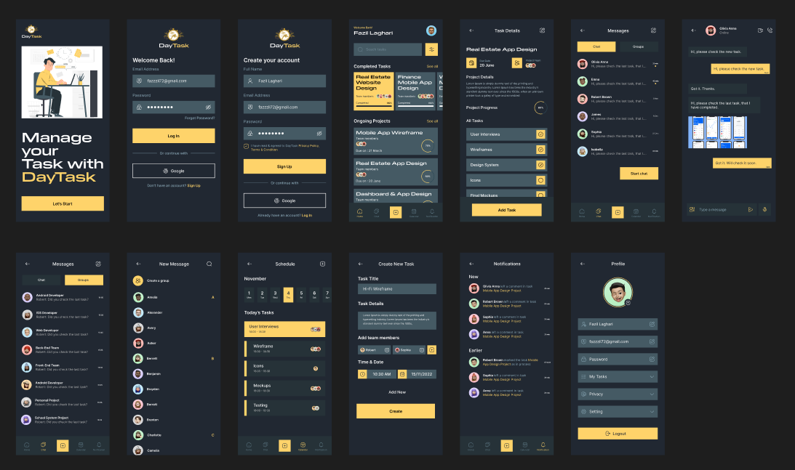
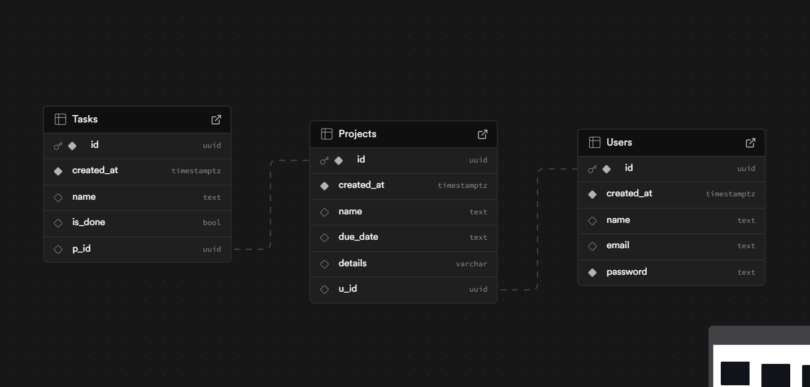

# Tasky

Tasky is a simple task management application that allows users to create accounts, add projects, and organize tasks under those projects. It supports real-time database updates and offers a clean and intuitive interface for task management.

# Ui


# Database Disign


## Features

- **User Account**: Users can create an account and log in.
- **Projects**: Users can add projects to organize their tasks.
- **Tasks**: Tasks can be added under specific projects.
- **Real-time Updates**: Changes in the database are reflected in real time.
- **UI Design**: Clean and intuitive UI (check out the design on [Figma](https://www.figma.com/community/file/1242943045226413091)).

## Future Features (Not Functional Yet)
- Local saving for offline usage.
- Add members to projects.
- Login via Gmail.
- Theme customization.

## Technologies Used

- **Supabase**: Backend database and real-time functionality.
- **Flutter**: Frontend for the mobile app.
- **GetX**: State management for efficient UI updates.
- **SharedPreferences**: For user login persistence.

## 📦 Deliverables

1. **GitHub Repo**: [Tasky GitHub Repository](https://github.com/RenderHaven/Tasky)
2. **Demo Video**: A working demo of the app can be found in the [YouTube/GDrive Link](#). (Please replace with actual link once uploaded.)
3. **README**: Detailed instructions on setting up and using the app.

## Setup Instructions

1. Clone the repository:
   ```bash
   git clone https://github.com/RenderHaven/Tasky.git
   cd Tasky
2. Supabase Setup:
    Create a Supabase account at Supabase.
    Set up a database with the given structure (you can refer to the structure shared in the documentation).
    Replace the keys in the Flutter project with your Supabase keys.
# Hot Reload vs Hot Restart
    Hot Reload: This feature allows you to inject code changes into the running app without restarting the whole app. It is perfect for quickly seeing UI changes without losing the app state.
    Hot Restart: This fully restarts the app, losing any current state and reinitializing the app from scratch. This is useful when you want to ensure that all code changes are applied correctly, especially when modifying the app's state or app lifecycle.